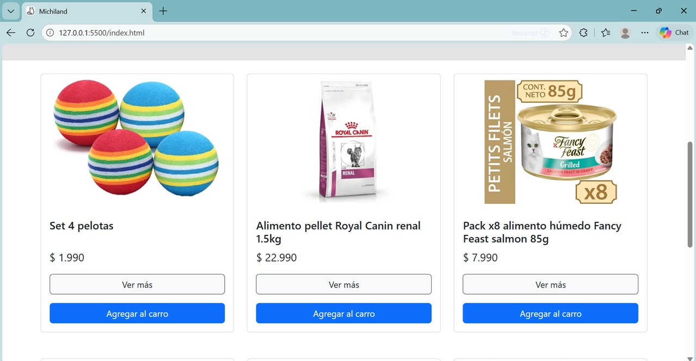

# 🐱 Michiland e-commerce para Gatitos

**Alumno:** Nicolás Andrés Cárdenas Aroca

---

## Tabla de contenidos

- [Acerca del proyecto](#acerca-del-proyecto)
- [Prerrequisito](#prerrequisito)
- [Uso](#uso)
- [Funcionalidades principales](#funcionalidades-principales)
- [Tecnologías utilizadas](#tecnologias-utilizadas)
- [Estructura del proyecto](#estructura-del-proyecto)
- [Licencia](#licencia)

---

## Acerca del proyecto

Michiland es una tienda ecommerce ficticia donde los usuarios pueden:

- Visualizar productos en una página principal (Inicio)
- Ver el detalle de cada producto
- Agregar productos a un carrito
- Visualizar y gestionar el carrito de compras

---

## Prerrequisito

- Navegador web actualizado (Google Chrome, Microsoft Edge o similar)
- Editor de código, por ejemplo Visual Studio Code
- Conexión a internet para cargar Bootstrap desde CDN

---

## Uso

El proyecto se encuentra disponible en GitHub.

1. Clonar el repositorio:

   git clone https://github.com/NicolasCardenas02/ecommerce-frontend-m2

2. Abrir la carpeta del proyecto

3. Ejecutar el archivo `index.html` en el navegador

4. Navegar por el sitio:
   - Ver productos en la página principal
   - Acceder al detalle de cada producto
   - Agregar productos al carrito
   - Gestionar el carrito (eliminar o vaciar productos)

---

## Funcionalidades principales

### Inicio

- Visualización de productos en cards usando Bootstrap
- Botón “Ver más” que redirige a detalle
- Botón “Agregar al carrito”

&nbsp;&nbsp;&nbsp;

[Archivo index.html](index.html)

---

### Detalle de producto

- Obtiene el ID desde la URL (`URLSearchParams`)
- Muestra información dinámica del producto
- Permite agregar al carrito


[Archivo detalle.html](detalle.html)

---

### Carrito de compras

- Lista productos agregados
- Calcula total dinámicamente
- Permite eliminar productos
- Permite vaciar el carrito


[Archivo carrito.html](carrito.html)

---

### Contador de carrito

- Se actualiza en tiempo real
- Se muestra en el navbar
- Usa `localStorage`.

```js
function agregarAlCarrito(id) {
  const carrito = obtenerCarrito();
  carrito.push(id);
  guardarCarrito(carrito);
  actualizarContador();
}
```

---

### JavaScript

El archivo `script.js` contiene:

- Arreglo de productos
- Funciones para:
  - agregar al carrito
  - eliminar productos
  - vaciar carrito
  - renderizar detalle
  - renderizar carrito

[Enlace al archivo script.js](assets/js/script.js)

---

### Estilos

Manejo de estilo de imagen.

```CSS
.ajuste-img {
  width: 100%;
  height: 250px;
  object-fit: contain;
  object-position: center;
}
```

---

## Tecnologías utilizadas

- HTML5 (estructura semántica)
- Bootstrap 5 (layout y componentes)
- JavaScript (DOM, eventos, lógica de carrito)
- Vs Code >= 1.113.0
- SO Windows 11

---

## Estructura del proyecto

```
/Proyecto portafolio M2
│
├── assets
│ ├── css
│ │ └── style.css
│ ├── js
│ │ └── script.js
│ └── img
│ └── (imágenes de productos)
│
├── index.html → Página principal
├── detalle.html → Vista de detalle del producto
└── carrito.html → Página del carrito de compras
```

---

## Licencia

Proyecto académico — Página web ecommerce MICHILAND, 2026.
